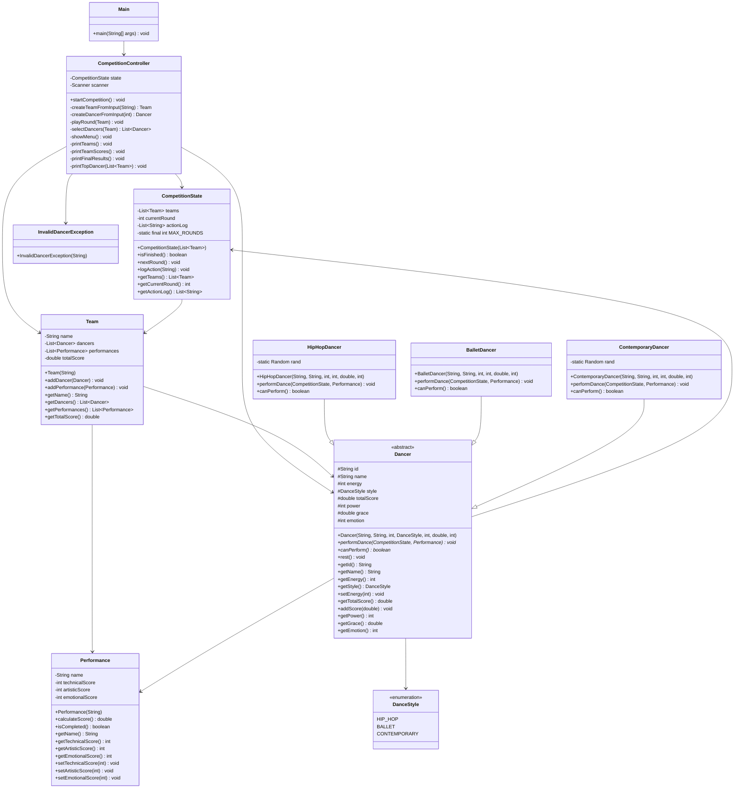

# Sơ đồ lớp - Hệ thống Quản lý Cuộc thi Nhảy

## 1. Sơ đồ lớp tổng quan



## 2. Chi tiết các lớp

### 2.1 Lớp Dancer (Abstract)
```java
abstract class Dancer {
    // Thuộc tính
    protected String id;           // ID duy nhất
    protected String name;         // Tên vũ công
    protected int energy;          // Năng lượng (0-100)
    protected DanceStyle style;    // Phong cách nhảy
    protected double totalScore;   // Tổng điểm biểu diễn
    protected int power;           // Sức mạnh (0-10)
    protected double grace;        // Sự duyên dáng (0-1)
    protected int emotion;         // Cảm xúc (0-10)
    
    // Phương thức trừu tượng
    abstract void performDance(CompetitionState state, Performance performance);
    abstract boolean canPerform();
    
    // Phương thức cụ thể
    void rest();                  // Hồi phục năng lượng
}
```

### 2.2 Các lớp con của Dancer

#### HipHopDancer
- **Đặc điểm**: Power ảnh hưởng mạnh nhất
- **Công thức tính điểm**: 
  - Technical: power×8 + grace×20 + emotion×2
  - Artistic: grace×30 + power×3 + emotion×3
  - Emotional: emotion×5 + power×2 + grace×10

#### BalletDancer
- **Đặc điểm**: Grace ảnh hưởng mạnh nhất
- **Công thức tính điểm**:
  - Technical: grace×40 + power×4 + emotion×2
  - Artistic: grace×50 + power×2 + emotion×4
  - Emotional: emotion×6 + grace×20 + power×2

#### ContemporaryDancer
- **Đặc điểm**: Emotion ảnh hưởng mạnh nhất + yếu tố ngẫu nhiên
- **Công thức tính điểm**:
  - Technical: power×5 + grace×25 + emotion×4 + random(10)
  - Artistic: grace×35 + power×3 + emotion×5 + random(10)
  - Emotional: emotion×8 + power×2 + grace×15 + random(10)

### 2.3 Lớp Team
```java
class Team {
    private String name;                    // Tên đội
    private List<Dancer> dancers;           // Danh sách vũ công
    private List<Performance> performances; // Danh sách biểu diễn
    private double totalScore;              // Tổng điểm đội
    
    // Phương thức chính
    void addDancer(Dancer dancer);          // Thêm vũ công
    void addPerformance(Performance perf);  // Thêm biểu diễn
    double getTotalScore();                 // Lấy tổng điểm
}
```

### 2.4 Lớp CompetitionState
```java
class CompetitionState {
    private List<Team> teams;               // Danh sách các đội
    private int currentRound;               // Lượt hiện tại
    private List<String> actionLog;         // Nhật ký hành động
    private static final int MAX_ROUNDS = 8; // Số lượt tối đa
    
    // Phương thức chính
    boolean isFinished();                   // Kiểm tra kết thúc
    void nextRound();                       // Chuyển lượt
    void logAction(String action);          // Ghi nhật ký
}
```

### 2.5 Lớp Performance
```java
class Performance {
    private String name;                    // Tên biểu diễn
    private int technicalScore;             // Điểm kỹ thuật
    private int artisticScore;              // Điểm nghệ thuật
    private int emotionalScore;             // Điểm cảm xúc
    
    // Phương thức chính
    double calculateScore();                // Tính điểm trung bình
    boolean isCompleted();                  // Kiểm tra hoàn thành
}
```

### 2.6 Lớp CompetitionController
```java
class CompetitionController {
    private CompetitionState state;         // Trạng thái cuộc thi
    private Scanner scanner;                // Scanner nhập liệu
    
    // Phương thức chính
    void startCompetition();                // Khởi động cuộc thi
    Team createTeamFromInput(String);       // Tạo đội từ input
    Dancer createDancerFromInput(int);      // Tạo vũ công từ input
    void playRound(Team);                   // Chơi một lượt
    List<Dancer> selectDancers(Team);       // Chọn vũ công biểu diễn
    void showMenu();                        // Hiển thị menu
    void printFinalResults();               // In kết quả cuối
}
```

## 3. Mối quan hệ giữa các lớp

### 3.1 Quan hệ kế thừa
- `HipHopDancer`, `BalletDancer`, `ContemporaryDancer` kế thừa từ `Dancer`

### 3.2 Quan hệ thành phần
- `CompetitionState` chứa `List<Team>`
- `Team` chứa `List<Dancer>` và `List<Performance>`
- `CompetitionController` sử dụng `CompetitionState`

### 3.3 Quan hệ sử dụng
- `Dancer` sử dụng `CompetitionState` và `Performance`
- `CompetitionController` sử dụng tất cả các lớp model

## 4. Luồng hoạt động chính

1. **Khởi tạo**: `Main` → `CompetitionController.startCompetition()`
2. **Nhập liệu**: Tạo các `Team` và `Dancer` từ input
3. **Thi đấu**: Lặp 8 lượt, mỗi lượt các `Team` biểu diễn
4. **Tính điểm**: `Dancer.performDance()` → `Performance.calculateScore()`
5. **Kết quả**: Sắp xếp và hiển thị bảng xếp hạng

## 5. Các tính năng đặc biệt

- **Combo điểm**: Nếu 3 vũ công cùng biểu diễn, điểm +10%
- **Menu tương tác**: Xem danh sách đội, điểm từng đội
- **Bảng xếp hạng**: Sắp xếp các đội theo điểm cuối cùng
- **Thống kê**: Vũ công có điểm cao nhất 